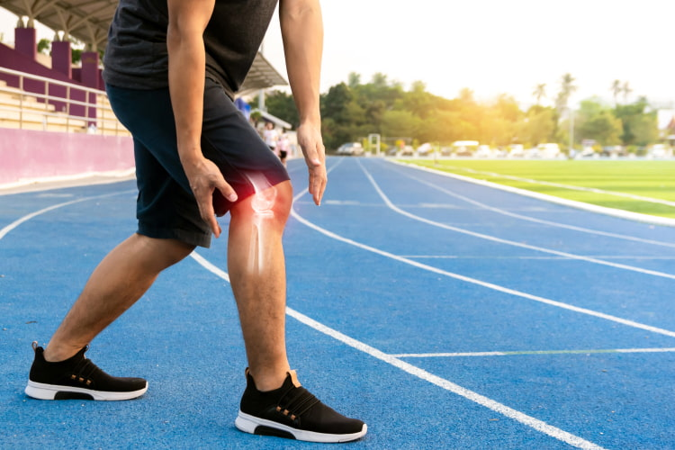

# **Probability of injury during sport activity**
 

All types of `sports` have a potential for injury, whether from the trauma of contact with other players or from overuse or misuse of a body part. Almost one-third of all injuries incurred in childhood are sports-related injuries. By far, the most common injuries are sprains and strains.

## **The goal of this project:** 

The aim is to estimate risks and rates in sport injury. Some `sports` are more dangerous than others. 

### *Type of sports to be relevant for the project:*
Any sporting activity can potentially cause injury. For the project research purposes, the following sport activities are considered:
- Bicycling
- Football
- In-line and roller skating 
- Snow skiing or snowboarding 
- Trampolines 

In general, playground, sports, and bicycle-related injuries occur most often among children between ages 5 and 14 years old. The highest rates of injury occur in sports that involve contact and collisions. More severe injuries occur during individual sports and recreational activities. Most organized sports-related injuries (62 percent) occur during practice.

As per review many researches, there are some issues in estimating risks and rates in sports injury research. For more information, please follow [The Findings](https://www.ncbi.nlm.nih.gov/pmc/articles/PMC1472638/).
